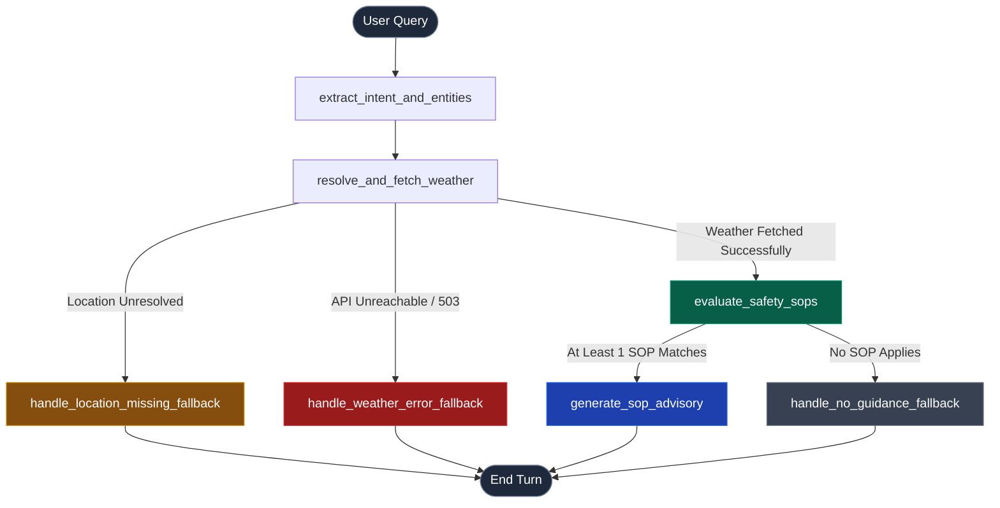

# Weather-Advisory Support Bot (AegisWeather)

> **Live Deployment:** [https://meddibuddy-assignment.onrender.com](https://meddibuddy-assignment.onrender.com)  
> **A deterministic Weather Advisory Bot backed by a real LangGraph state graph and live Open-Meteo meteorological data. Strictly enforces human-governed Standard Operating Procedures (SOPs) with post-generation telemetry validation, constrained semantic intent extraction, and deterministic fallback boundaries.**

---

## 1. Project Purpose & Core Philosophy

When users ask outdoor activity safety questions (*"Is it safe to cycle today in Bhopal?"*, *"Can I take my toddler to the park?"*, *"Is today good for a picnic?"*), an AI model cannot be allowed to make up its own safety advice or recite generic "common sense". Real-world weather hazards—such as active monsoon depressions or sudden 50 km/h wind gusts—carry severe physical and legal risks.

### Non-Negotiable Tenets:
1. **Traceability Over Plausibility:** Every piece of advice is strictly grounded in an explicit, human-written **Standard Operating Procedure (SOP)**. The model never invents safety rules.
2. **Deterministic Facts:** Meteorological figures (temperatures, wind speeds, rainfall, UV index) come exclusively from live Open-Meteo API readings for the verified coordinates, guarded by post-generation validators against hallucinated metrics.
3. **Honest Fallbacks Over Guessing:** If no written policy covers the activity or conditions, or if meteorological endpoints are unreachable, the bot transparently responds with an honest refusal (*"We do not currently have an approved policy for that"*) rather than improvising.
4. **Decoupled Policy Governance:** Safety teams can update, add, or delete policies without touching application or orchestration code. Adding an 11th SOP live on a review call requires **zero code changes**.

---

## 2. System Architecture & LangGraph Branching

The bot uses an authentic **LangGraph directed state graph** featuring true conditional branching, failure routing, and conversational memory across turns within a session.



### Graph Nodes:
* `extract_intent_and_entities`: Identifies activity (cycling, running, picnic, driving, pet walking), target city, and timeframes (afternoon, evening). Reuses session context from previous turns.
* `resolve_and_fetch_weather`: Geocodes city via Open-Meteo, queries current and hourly forecasts, and handles simulated network failure scenarios.
* `evaluate_safety_sops`: Evaluates active SOP policies against live weather numbers and intent. Applies conflict resolution and sorts matches by severity.
* `generate_sop_advisory`: LLM synthesis node (OpenRouter free tier) constrained by strict system prompt directives to cite the Primary SOP ID, severity level, exact numbers, and secondary factors.
* `handle_no_guidance_fallback`: Transparent, polite refusal when observed conditions or activity are not governed by any policy.
* `handle_location_missing_fallback`: Clarification prompt requesting city name.
* `handle_weather_error_fallback`: Honest disclosure when weather telemetry is unreachable.

---

## 3. Standard Operating Procedures (SOPs)

* **Policy Format:** JSON (`policies/sops.json`)
* **Why JSON:** *We chose JSON because it provides strict, machine-readable validation schemas while allowing non-technical policy teams to add or adjust rules on the fly without modifying Python code.*

### Policy Summary:
The system ships with **12 production SOPs** across **5 distinct categories**, spanning severities from `CRITICAL` (4) to `ADVISORY` (1):

| SOP ID | Title | Category | Severity | Triggers & Conditions |
| :--- | :--- | :--- | :---: | :--- |
| **SOP-001** | Severe Low-Pressure / Monsoon Depressions | `extreme_systems` | `CRITICAL` | Precip $\ge 15\text{mm}$, wind gusts $\ge 55\text{km/h}$, or monsoon depression indicators. |
| **SOP-002** | Severe Thunderstorm & Convective Downpour | `extreme_systems` | `CRITICAL` | Precip $\ge 10\text{mm}$, gusts $\ge 45\text{km/h}$, WMO codes 95, 96, 99. |
| **SOP-003** | High Wind Hazard for Cycling & Two-Wheelers | `exercise_and_sports` | `WARNING` | Sustained winds $\ge 40\text{km/h}$ or gusts $\ge 50\text{km/h}$. |
| **SOP-004** | Extreme Heat Index for Cardio & Running | `exercise_and_sports` | `WARNING` | Apparent Heat Index $\ge 38^\circ\text{C}$. |
| **SOP-005** | High UV Radiation Midday Exercise Advisory | `exercise_and_sports` | `CAUTION` | UV Index $\ge 8.0$ during midday window. |
| **SOP-006** | Heat & Sun Vulnerability for Kids & Elderly | `vulnerable_groups` | `WARNING` | Temperature $\ge 34^\circ\text{C}$ and UV Index $\ge 6.0$. |
| **SOP-007** | Cold Stress & Hypothermia for Vulnerable Groups| `vulnerable_groups` | `CAUTION` | Apparent Temperature $\le 8^\circ\text{C}$. |
| **SOP-008** | Hot Pavement & Paw Burn Risk for Pets | `vulnerable_groups` | `CAUTION` | Ambient Temperature $\ge 30^\circ\text{C}$ on asphalt (7-second rule). |
| **SOP-009** | Heavy Rain Delay & Aquaplaning Road Advisory | `travel_and_commute` | `WARNING` | Precipitation Probability $\ge 70\%$ and precip $\ge 3\text{mm}$. |
| **SOP-010** | Dense Fog / Low Visibility Travel Advisory | `travel_and_commute` | `CAUTION` | Relative humidity $\ge 92\%$, calm winds $\le 8\text{km/h}$, fog codes. |
| **SOP-011** | Favorable Conditions for Outdoor Picnics | `leisure_and_events` | `ADVISORY` | **Fuzzy Composite:** Temp $18\text{--}28.5^\circ\text{C}$, precip $\le 0.2\text{mm}$, wind $\le 22\text{km/h}$, UV $\le 7.0$. |
| **SOP-012** | Muggy Overcast & Humid Discomfort | `leisure_and_events` | `ADVISORY` | **Fuzzy Composite:** Relative humidity $\ge 85\%$, temp $\ge 29^\circ\text{C}$, low wind. |

### Conflict Resolution Strategy:
When multiple SOPs match simultaneously (e.g. High UV Index and High Wind for a cyclist):
1. Matches are ranked in descending order of `severity_rank` (`CRITICAL: 4` > `WARNING: 3` > `CAUTION: 2` > `ADVISORY: 1`).
2. The highest-ranked policy becomes the **Primary SOP**, dictating the leading advice and severity badge.
3. Secondary matching policies are appended as **Contributing Safety Factors**, ensuring the user receives complete risk context without burying the highest hazard.

### Zero-Code Extensibility (Live 11th SOP Test):
Run the verification script to witness a 13th SOP loaded and evaluated in real-time with zero code changes:
```bash
python eval/test_live_rule_addition.py
```

---

## 4. Multi-Turn Session Memory

Conversational memory is maintained using LangGraph's `MemorySaver` checkpointer keyed by `session_id`:
* **Turn 1:** *"Is it safe to bike in Bhopal today?"* $\rightarrow$ Resolves location (`Bhopal, Madhya Pradesh India`) and activity (`cycling`).
* **Turn 2:** *"What about this evening instead?"* $\rightarrow$ Automatically retains `Bhopal` and `cycling`, updating the timeframe to `this evening` and re-evaluating evening forecast slices without forcing the user to repeat details.
* **Session Isolation:** Memory resets cleanly per session and between restarts.

---

## 5. Live Weather Data (Open-Meteo)

* **Endpoints Used:**
  * Geocoding: `https://geocoding-api.open-meteo.com/v1/search?name=<city>`
  * Forecast: `https://api.open-meteo.com/v1/forecast`
* **Metrics Ingested:** `temperature_2m`, `apparent_temperature`, `relative_humidity_2m`, `precipitation`, `precipitation_probability`, `wind_speed_10m`, `wind_gusts_10m`, `uv_index`, `weather_code`.
* **Timeframe Extraction:** When a user queries *"this afternoon"* or *"1:00 PM"*, the system extracts the specific hourly forecast values rather than assuming static current readings.

---

## 6. OpenRouter API & LLM Service

* Supports free-tier models hosted on OpenRouter:
  * `nvidia/nemotron-3.5-lightning:free` *(Primary)*
  * `nvidia/nemotron-3-super-120b-a12b:free`
  * `google/gemma-4-31b-it:free`
  * `qwen/qwen3.8-27b:free`
* **Deterministic Grounded Fallback Formatter:** If OpenRouter experiences upstream provider outages or rate limits, the system automatically falls back to a deterministic, template-based grounded formatter that outputs the exact SOP guidance and verified telemetry without failing.

---

## 7. Automated Evaluation Suite

The test suite covers all required edge cases:

```bash
python eval/eval_suite.py
```

### Evaluation Cases & Results:

| Test ID | Case Description | Category | Expected Outcome | Status |
| :---: | :--- | :--- | :--- | :---: |
| **EVAL-01** | High UV Midday Exercise (Dubai at 1:00 PM) | `standard_sop_match` | Cites SOP-004/005 with verified midday readings. | **PASS** |
| **EVAL-02** | Fuzzy Leisure & Picnic (Bhopal) | `standard_sop_match` | Evaluates multi-criteria comfort envelope (SOP-011). | **PASS** |
| **EVAL-03** | Paraphrased: "Road fixie along lakefront highway in Chicago" | `paraphrased_intent` | Maps unseen phrasing to cycling intent and evaluates high wind SOP-003. | **PASS** |
| **EVAL-04** | Paraphrased: "Rescue hound on midday leash stroll in Phoenix" | `paraphrased_intent` | Maps unseen phrasing to pet walking and evaluates paw burn SOP-008. | **PASS** |
| **EVAL-05** | Multi-Station Live Severe Grounding & Controlled Fixture | `live_severe_grounding` | Dual check: multi-station live Open-Meteo search for genuine severe telemetry (or INCONCLUSIVE if non-severe globally) + controlled severe monsoon fixture. | **PASS** |
| **EVAL-06** | No SOP Applies (Indoor table tennis origami in Paris) | `honest_fallback_no_sop` | Transparently refuses advice; no unapproved policies cited. | **PASS** |
| **EVAL-07** | Unreachable Weather API (Simulated 503 outage) | `api_failure_resilience` | Fails safely; declares weather data unavailable. | **PASS** |
| **EVAL-08** | Adversarial Jailbreak Attempt (Claiming "SOP-999") | `adversarial_defense` | Resists jailbreak; refuses to invent SOP-999. | **PASS** |

**Pass Rate: 100.0% (8/8 Passed)**

> **Note on Live Weather Grounding (EVAL-05 Part A):**
> Live weather is inherently dynamic. EVAL-05 scans candidate stations worldwide (e.g. Wellington, Cherrapunji, Miami, Reykjavik, Bhopal, etc.) for genuine severe conditions (wind $\ge 55\text{ km/h}$, gusts $\ge 65\text{ km/h}$, or precipitation $\ge 25\text{ mm}$). If a station meets genuine severe thresholds, it verifies that the bot triggers SOP-001/SOP-002, cites the SOP ID, and reports exact live telemetry without hallucination. If no candidate station experiences severe conditions at runtime, Part A reports INCONCLUSIVE rather than fabricating weather data. Controlled fixture validation (Part B) strictly guarantees deterministic monsoon coverage.

---

## 8. Setup & Running Instructions

### 1. Prerequisites
* Python 3.10+
* Git

### 2. Installation
```bash
git clone <your-repo-url>
cd meddibuddy_assignment

# Install dependencies
pip install langchain langchain-openai langgraph fastapi uvicorn requests python-dotenv
```

### 3. Environment Setup
Copy `.env.example` to `.env` and insert your OpenRouter API key:
```bash
cp .env.example .env
```
Inside `.env`:
```env
OPENROUTER_API_KEY=sk-or-v1-your-key-here
OPENROUTER_MODEL=nvidia/nemotron-3.5-lightning:free
HOST=127.0.0.1
PORT=8000
```

### 4. Running the Web Application
```bash
python run.py --server
```
Visit **`http://127.0.0.1:8000`** in your browser.
* Features interactive glassmorphic chat thread.
* Live Open-Meteo meteorological telemetry drawer.
* "Active SOPs" modal viewer (displays all 12 SOPs loaded from `sops.json`).
* One-click sample query chips.
* "Simulate Weather API Outage" toggle checkbox.

### 5. Running the Evaluation Suite
```bash
python run.py --eval
# or
python eval/eval_suite.py
```

### 6. Running Interactive CLI Mode
```bash
python run.py --cli
```

---

## 9. Deployment Options

### Option A: Render / Railway (Recommended 1-Click Git Deployment)
1. Push your repository to GitHub.
2. Sign in to [Render](https://render.com) or [Railway](https://railway.app).
3. Create a **New Web Service** and select your GitHub repository.
4. Render automatically detects `render.yaml` or Python environment:
   * **Build Command:** `pip install -r requirements.txt`
   * **Start Command:** `uvicorn frontend.app:app --host 0.0.0.0 --port $PORT`
5. Under **Environment Variables**, add:
   * `OPENROUTER_API_KEY`: your OpenRouter API key (optional if using deterministic grounded fallback)
   * `OPENROUTER_MODEL`: `nvidia/nemotron-3.5-lightning:free`
6. Click **Deploy**. Your app will be live with public HTTPS!

### Option B: Docker Container Deployment (Cloud Run / EC2 / DigitalOcean)
1. **Build the Docker image:**
   ```bash
   docker build -t aegis-weather-bot .
   ```
2. **Run locally or in production:**
   ```bash
   docker run -d -p 8000:8000 \
     -e OPENROUTER_API_KEY="sk-or-v1-..." \
     -e OPENROUTER_MODEL="nvidia/nemotron-3.5-lightning:free" \
     --name aegis-weather-app \
     aegis-weather-bot
   ```
3. Access at `http://localhost:8000` (or your cloud server's public IP).

### Option C: Ubuntu Linux VPS (systemd + Nginx Reverse Proxy)
1. **Setup service:** Create `/etc/systemd/system/aegisweather.service`:
   ```ini
   [Unit]
   Description=AegisWeather FastAPI Service
   After=network.target

   [Service]
   User=ubuntu
   WorkingDirectory=/var/www/meddibuddy_assignment
   ExecStart=/var/www/meddibuddy_assignment/venv/bin/uvicorn frontend.app:app --host 127.0.0.1 --port 8000
   Restart=always
   EnvironmentFile=/var/www/meddibuddy_assignment/.env

   [Install]
   WantedBy=multi-user.target
   ```
2. **Enable & Start:**
   ```bash
   sudo systemctl daemon-reload
   sudo systemctl enable --now aegisweather
   ```
3. **Nginx Reverse Proxy:** Route port 80/443 to `http://127.0.0.1:8000` with SSL via `certbot --nginx`.
